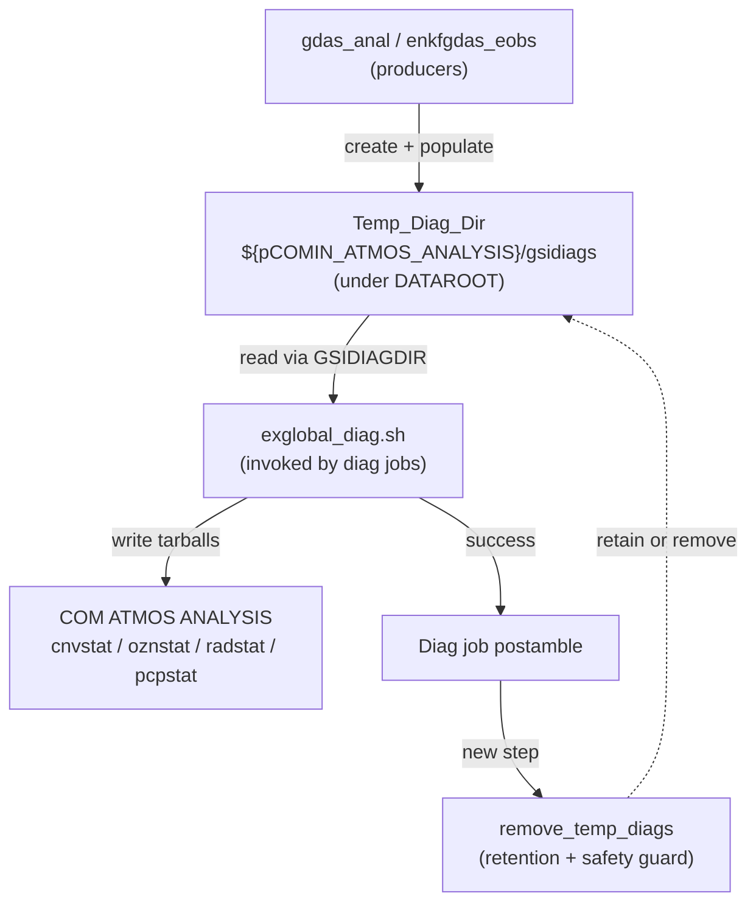
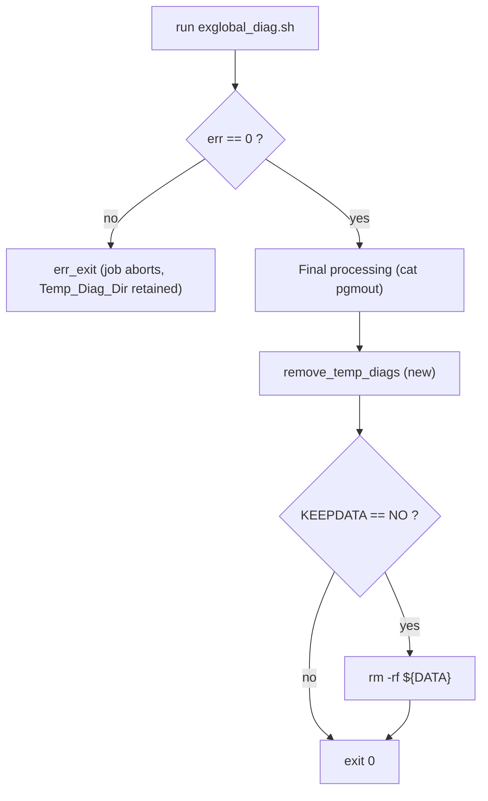

# Design Document

## Overview

The GSI diagnostic jobs `gdas_analdiag` (`JGLOBAL_ATMOS_ANALYSIS_DIAG`) and
`enkfgdas_ediag` (`JGLOBAL_ENKF_DIAG`) are the last consumers of the shared
`gsidiags` staging directory that the upstream analysis jobs create under
DATAROOT. Today each diag job removes only its own per-job scratch directory
(`${DATA}`) when `KEEPDATA == NO`; the shared `gsidiags` tree is left behind and
wastes scratch space.

This feature adds a small, self-contained cleanup step to the end of each diag
job that removes the shared staging directory
(`Temp_Diag_Dir = ${pCOMIN_ATMOS_ANALYSIS}/gsidiags`) once the diagnostic
tarballs have been written to COM. Removal is gated by the existing `KEEPDATA`
convention plus a new optional `KEEP_TEMP_DIAGS` override, and is protected by a
narrow safety guard so it can only ever delete the resolved `gsidiags` subtree.

This is a deliberately small shell/workflow change. It introduces one tiny
shared `ush` helper function and two call sites; it does not add any new
framework, abstraction layer, or build machinery.

### Goals

- Reclaim DATAROOT scratch by deleting `Temp_Diag_Dir` from the diag jobs.
- Honor `KEEPDATA`; add `KEEP_TEMP_DIAGS` (default `NO`, forced `NO` in ops) as
  an override that affects only `Temp_Diag_Dir`.
- Never delete COM outputs, `DATAROOT`, or anything outside the `gsidiags`
  subtree; never follow symlinks out of that subtree.
- Never fail the job because of a cleanup problem (diagnostics are already
  produced by the time cleanup runs).

### Non-Goals

- Changing where or how the producer jobs create `gsidiags`.
- Changing `exglobal_diag.sh` tarball generation logic.
- Introducing a general-purpose cleanup framework or new configuration system.

## Architecture

### Where the change lives

The producer/consumer flow is unchanged. Only the postamble of the two diag
jobs gains a cleanup call.



### Control flow inside a diag job

The existing job structure already guarantees ordering: `exglobal_diag.sh` runs
first, its return code is checked, and `err_exit` aborts the job on failure.
Because `err_exit` terminates the job, reaching the postamble means the tarballs
were written successfully. The new cleanup step is inserted into the existing
"Remove the Temporary working directory" block, alongside the `${DATA}` removal.



Placing `remove_temp_diags` before the `${DATA}` removal is intentional: the
retention decision for `Temp_Diag_Dir` is independent of the `${DATA}` decision,
and the shared staging directory is the larger scratch consumer.

### Strict-mode consideration

Both diag jobs source `ush/set_strict.sh`, which by default (`STRICT=YES`)
enables `set -eu -o pipefail`. Cleanup is fail-loud: retention and "already
gone" exit 0, but a genuine cleanup failure (guard trip, unresolvable path,
undefined DATAROOT, unrecognized `KEEP_TEMP_DIAGS`, or `rm` failure) exits
non-zero. Because the helper runs under `set -e`, that non-zero exit aborts the
job and surfaces the cleanup problem to operations rather than silently leaking
scratch. Normal runs are unaffected — the guards only trip on anomalous input,
and the intermediate `[[ ... ]]` tests remain `set -e`-safe.

## Components and Interfaces

### 1. New shared helper: `ush/remove_temp_diags.sh`

A single small function, following the established `ush` utility pattern (define
function, then `declare -xf`). Both diag jobs perform identical cleanup with
identical safety requirements, so the logic is centralized in one place rather
than duplicated across two jobs. This also makes the retention decision and the
safety guard unit-testable in isolation.

Interface:

```
remove_temp_diags <temp_diag_dir>
```

Inputs (from the environment / argument):
- `$1` — the resolved `Temp_Diag_Dir` path (the caller passes
  `"${pCOMIN_ATMOS_ANALYSIS}/gsidiags"`).
- `KEEPDATA` — existing retention flag (`YES` retains, anything else removes).
- `KEEP_TEMP_DIAGS` — optional override (`YES` / `NO` / unset / other).
- `DATAROOT`, `COMIN_ATMOS_ANALYSIS`, `COMOUT_ATMOS_ANALYSIS` — used only by the
  safety guard to reject dangerous paths.

Behavior (in order):
1. **Resolve/validate**: if `$1` is unset or empty, log an error and exit 1.
2. **Retention decision** (see decision table below): if the decision is
   *retain*, log an informational message and exit 0; an unrecognized
   `KEEP_TEMP_DIAGS` value retains but exits 1.
3. **Safety guard** (see below): if the path fails any guard check, log an
   error and exit 1 without deleting anything.
4. **Remove**: if the path does not exist, log and exit 0. Otherwise `rm -rf`
   the resolved path only; on failure log an error and exit 1.

Return value: `0` for a completed cleanup or an intentional retain / no-op; `1`
for any genuine cleanup failure. Under `set -e` a non-zero exit aborts the
calling job so the problem is surfaced instead of near-silently skipped.

Output: human-readable `INFO` / `WARNING` lines to stdout/stderr consistent with
the surrounding job logging style. The helper does not call `err_exit` (a
cleanup issue must not kill a job whose products are already written).

### 2. Call site: `dev/jobs/JGLOBAL_ATMOS_ANALYSIS_DIAG`

The existing final block:

```bash
##########################################
# Remove the Temporary working directory
##########################################
cd "${DATAROOT}" || true
if [[ "${KEEPDATA}" == "NO" ]]; then
    rm -rf "${DATA}"
fi
```

becomes (conceptually):

```bash
##########################################
# Remove the shared temporary diagnostic directory (gsidiags)
##########################################
remove_temp_diags "${pCOMIN_ATMOS_ANALYSIS}/gsidiags"

##########################################
# Remove the Temporary working directory
##########################################
cd "${DATAROOT}" || true
if [[ "${KEEPDATA}" == "NO" ]]; then
    rm -rf "${DATA}"
fi
```

### 3. Call site: `dev/jobs/JGLOBAL_ENKF_DIAG`

Identical insertion, same argument. Both jobs already export
`pCOMIN_ATMOS_ANALYSIS`, so no new path derivation is required.

### 4. Sourcing the helper

The helper is sourced through the existing common setup so both jobs pick it up
without per-job wiring, matching how `dataroot_com_path.sh`, `err_exit.sh`, etc.
are sourced:

```bash
# in ush/jjob_shell_setup.sh, alongside the other utility sources
source "${USHglobal}/remove_temp_diags.sh"
```

### 5. Configuration: `KEEP_TEMP_DIAGS` in `config.analdiag` and `config.ediag`

Both diag configs (`dev/parm/config/gfs/config.analdiag` and
`dev/parm/config/gfs/config.ediag`) declare the flag with a default of `NO`
(Req 4.3). Example for `config.analdiag`:

```bash
echo "BEGIN: config.analdiag"

# Get task specific resources
source "${EXPDIR}/config.resources" analdiag

# Retain the shared temporary GSI diagnostic staging directory (gsidiags)
# for debugging. Default NO; forced NO in operations.
export KEEP_TEMP_DIAGS="NO"

echo "END: config.analdiag"
```

Operations forcing (Req 4.4): the operational (NCO) run sets/keeps
`KEEP_TEMP_DIAGS=NO`. Because the config default is already `NO`, ops behavior is
correct by default; the value is stated explicitly in the config so an operator
cannot silently inherit a non-`NO` value. If a `RUN_ENVIR == "nco"` / production
guard is preferred, the config can hard-set `KEEP_TEMP_DIAGS="NO"` under that
condition; the default already yields the same result.

## Data Models

There are no structured data models. The feature operates on:

- **Filesystem path** — `Temp_Diag_Dir`, a directory string of the form
  `${DATAROOT}/${RUN}.${PDY}/${cyc}/.../analysis/atmos/gsidiags` produced by
  `dataroot_com_path` + `/gsidiags`.
- **Two string flags** — `KEEPDATA` and `KEEP_TEMP_DIAGS`, each effectively an
  enum over `{YES, NO, unset/empty, other}`.

### Retention decision table

`KEEP_TEMP_DIAGS` overrides `KEEPDATA`. When `KEEP_TEMP_DIAGS` is unset/empty,
`Temp_Diag_Dir` follows the same decision `KEEPDATA` applies to `${DATA}`.

| `KEEP_TEMP_DIAGS` | `KEEPDATA` | Action on `Temp_Diag_Dir` | Notes |
|---|---|---|---|
| `YES` | any | **retain** | override to keep (Req 3.4, 4.1) |
| `NO` | any | **remove** | override to remove (Req 3.5, 4.2) |
| unset/empty | `YES` | **retain** | follows KEEPDATA (Req 3.1, 4.5) |
| unset/empty | not `YES` (incl. unset/empty) | **remove** | follows KEEPDATA (Req 3.2, 4.5) |
| other (e.g. `maybe`) | any | **remove** + error message | invalid value (Req 4.6) |

### Safety guard (path scoping)

Before any removal, the resolved path must pass all of these or removal is
skipped (and a skip message recorded):

- Path is defined and non-empty (Req 5.3).
- Path basename is `gsidiags` and it sits under `DATAROOT` (positive scoping to
  the intended subtree).
- Path is **not** equal to, and **not** a parent of, `DATAROOT`,
  `COMIN_ATMOS_ANALYSIS`, or `COMOUT_ATMOS_ANALYSIS` (Req 5.4).
- Removal targets only the resolved subtree and does not follow symlinks that
  leave it. `rm -rf <dir>` removes the directory entry and its contents; it does
  not traverse *through* a symlinked directory to delete outside targets, and
  the guard additionally rejects a `Temp_Diag_Dir` that is itself a symlink
  pointing outside `DATAROOT` (Req 5.1, 5.5).

Because the removal names exactly the resolved `gsidiags` path, COM tarballs
(which live under `COMOUT_ATMOS_ANALYSIS`, a different subtree) are inherently
untouched (Req 5.2).

## Error Handling

This is a shell workflow change; error handling follows the repo's existing
conventions (`err_exit`/`err`), but deliberately does **not** abort the job for
cleanup problems since the job's products are already written by the time
cleanup runs.

- **Diagnostic generation failure** — unchanged: `exglobal_diag.sh` returns
  non-zero, the job calls `err_exit`, the job aborts, and `Temp_Diag_Dir` is
  left in place (Req 2.5; the analdiag job aborts before cleanup for the same
  reason).
- **`Temp_Diag_Dir` missing at cleanup time** — treated as success (nothing to
  do), logged as `INFO`, job continues (Req 1.3, 2.3).
- **`rm -rf` failure** (e.g. permissions) — emit a `WARNING` (analdiag, Req 1.5)
  / error indication (ediag, Req 2.6) naming the path and the failure; the
  helper still returns success so the job completes normally.
- **Unresolvable/empty path** — skip removal, record a skip message, return
  success (Req 5.3).
- **Dangerous path** (equals or is a parent of DATAROOT/COM, or symlink out of
  subtree) — skip removal, record a skip message, return success (Req 5.4, 5.5).
- **Invalid `KEEP_TEMP_DIAGS`** — treat as remove, emit an error indication
  naming the unrecognized value, then apply the safety guard as usual (Req 4.6).
- **Strict mode** — all steps are `set -e`-safe (`[[ ]]` tests and
  failure-tolerant removal), so cleanup cannot cause a spurious job abort.

## Testing Strategy

### Property-based testing is not applicable

This feature is a shell/workflow change whose core is a side-effecting
filesystem operation (`rm -rf`) plus a small, finite decision. There is no pure
function over a large or infinite input space to quantify over:

- The retention decision is a finite truth table (`KEEP_TEMP_DIAGS` ×
  `KEEPDATA`, four states each) — best covered exhaustively by example/edge-case
  tests, not by randomized property generation.
- The safety guard and removal are I/O against the filesystem; their correctness
  is about specific dangerous-path cases and actual deletion side effects, which
  are verified with targeted examples and a temp-directory fixture.

The repository has no bash property-testing (or bats) harness, and adding one
for a finite truth table would be disproportionate machinery. Accordingly, the
Correctness Properties section is intentionally omitted, and testing relies on
static analysis, focused unit tests of the extracted helper, and CI integration.

### 1. Static analysis (existing CI)

- `shellcheck` on `ush/remove_temp_diags.sh`, the two modified `JGLOBAL_*_DIAG`
  jobs, and the two configs, via the existing `bash_code_analysis` workflow.

### 2. Unit tests of the helper (example + edge cases)

Because the logic is extracted into `remove_temp_diags` (a sourceable function),
it can be exercised directly with a temporary directory fixture. Enumerate the
decision table and the guard cases:

- Retention decisions (exhaustive over the table): each combination of
  `KEEP_TEMP_DIAGS ∈ {YES, NO, unset, "maybe"}` and
  `KEEPDATA ∈ {YES, NO, unset}` yields the expected retain/remove outcome
  (Req 3.1–3.5, 4.1, 4.2, 4.5, 4.6).
- Invalid `KEEP_TEMP_DIAGS` (`"maybe"`) → directory removed and an error
  message emitted (Req 4.6).
- Missing `Temp_Diag_Dir` → returns success, no error (Req 1.3, 2.3).
- Empty/unset path argument → skip + message, returns success (Req 5.3).
- Dangerous paths: path equal to `DATAROOT`; path that is a parent of
  `DATAROOT`/COM; `gsidiags` symlink pointing outside `DATAROOT` → all skipped,
  nothing deleted (Req 5.1, 5.4, 5.5).
- Removal side effect: with a populated temp `gsidiags` fixture and remove
  decision, the fixture is gone afterward while a sibling "COM" fixture and its
  tarball files remain (Req 1.1, 1.2, 2.1, 2.2, 5.2).
- Failure tolerance: simulate a non-removable path (e.g. read-only parent) →
  warning emitted, function returns success (Req 1.5, 2.6).

These run as small standalone bash test scripts (self-contained, using
`mktemp -d` fixtures) so they need no cluster resources, consistent with the
repo's lightweight `ush` utilities.

### 3. Integration validation (CI cycle)

- A gdas cycle CI case that runs `gdas_analdiag` and `enkfgdas_ediag` end to end
  confirms, in a realistic environment, that the `gsidiags` directory is gone
  after a default (`KEEPDATA=NO`, `KEEP_TEMP_DIAGS=NO`) run while the cnvstat /
  oznstat / radstat / pcpstat tarballs remain in COM (Req 1.1, 5.2). A
  `KEEPDATA=YES` run confirms retention (Req 3.1). These are 1–2 representative
  runs, not a repeated/randomized suite.

### Verification before completion

- Run `shellcheck` on all modified shell files and fix findings.
- Run the helper unit test script and confirm all cases pass.
